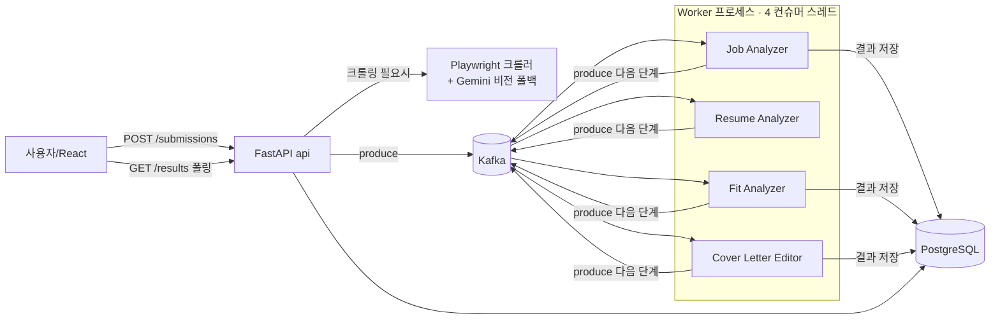
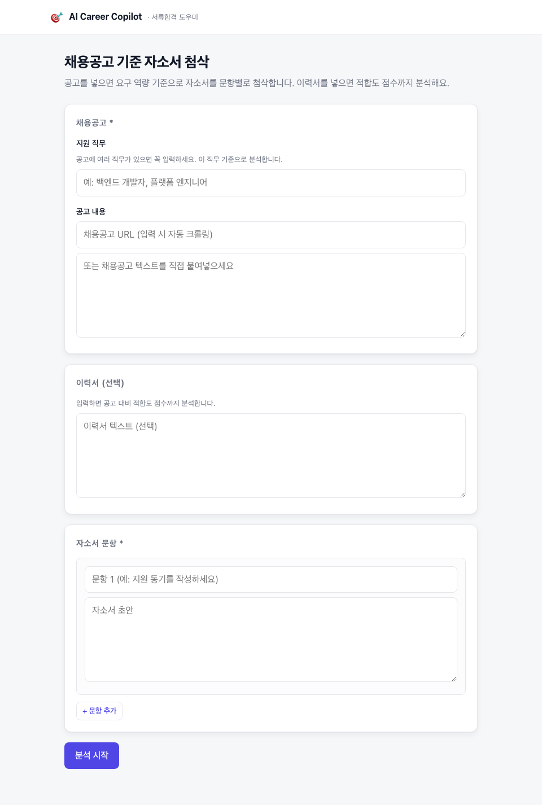
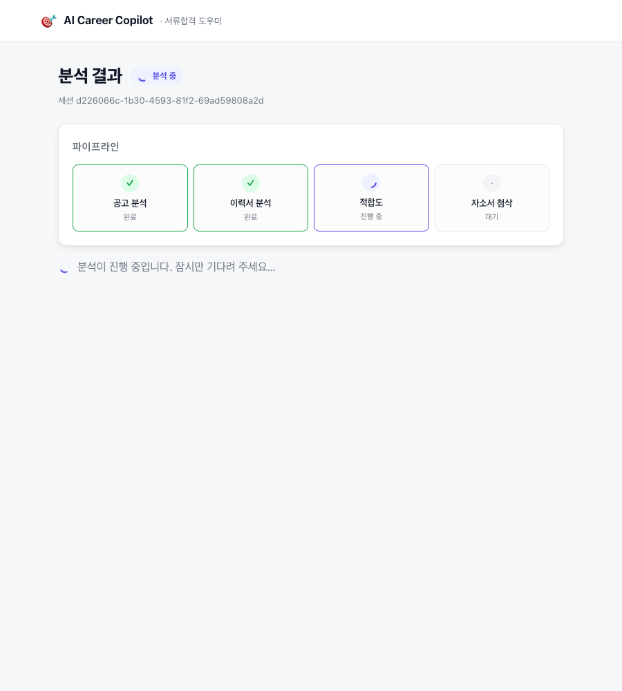
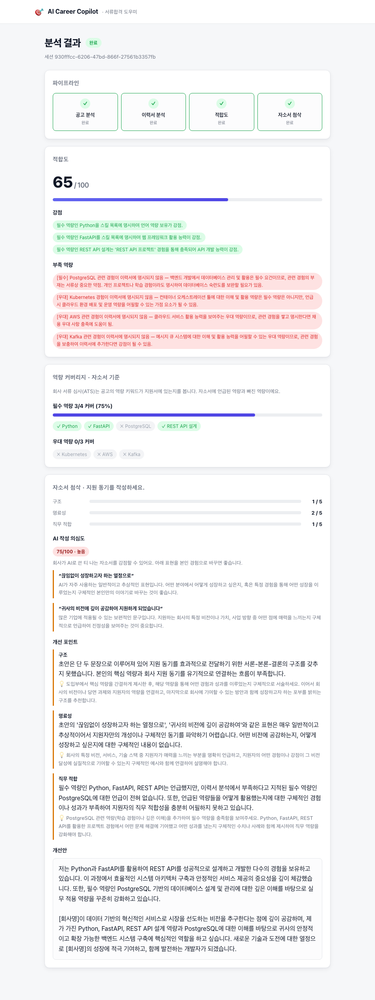

# AI Career Copilot — 프로젝트 발표 자료

> 멀티 에이전트 + Kafka 이벤트 드리븐 구조로 **채용공고 기준 자소서 첨삭(서류합격)** 을 돕는 어시스턴트

---

## 1. 한 줄 소개 & 문제의식

- **문제**: 취준생은 공고·이력서·자소서를 따로 준비하며, "이 공고에 내 자소서가 얼마나 맞는지", "어디를 어떻게 고쳐야 하는지"를 일관되게 피드백받기 어렵다.
- **해결**: 채용공고를 넣으면 **요구 역량을 분석**하고, 그 기준으로 **자소서를 문항별로 첨삭**한다. 이력서를 넣으면 **적합도 점수**까지 계산한다.
- **핵심 컨셉**: 4개의 AI 에이전트가 **Kafka 토픽으로 느슨하게 연결**되어, 각 단계가 독립적으로 동작하는 **이벤트 드리븐 파이프라인**.

---

## 2. 아키텍처



- **api**(FastAPI): 입력 수신, 크롤링, Kafka 발행, 결과 조회
- **worker**: `run_worker.py`가 4개 에이전트를 각각 **스레드**로 실행 (각자 독립 Kafka 컨슈머)
- **PostgreSQL**: 단계별 결과 영속화 → api와 worker가 **공유**
- **web**(React+TS): 입력 폼 + 결과 폴링 대시보드

### Kafka 토픽 흐름

```
job.submitted        → Job Analyzer        → job.analyzed
resume.submitted     → Resume Analyzer     → resume.analyzed      (이력서 있을 때만)
job.analyzed +
resume.analyzed      → Fit Analyzer        → fit.analyzed         (이력서 있을 때만)
coverletter.submitted +
job.analyzed(+fit)   → Cover Letter Editor → coverletter.done
```

| 에이전트 | 컨슈머 그룹 | 입력 → 출력 |
|---|---|---|
| Job Analyzer | `job-analyzer` | 공고 텍스트 → 필수/우대 역량 |
| Resume Analyzer | `resume-analyzer` | 이력서 → 스킬/프로젝트 |
| Fit Analyzer | `fit-analyzer` | 공고+이력서 분석 → 적합도 점수·강점·약점 |
| Cover Letter Editor | `coverletter-editor` | 공고(+적합도)+자소서 → 문항별 첨삭 |

---

## 3. 기술 스택

| 영역 | 기술 |
|---|---|
| Backend | Python, FastAPI, Uvicorn |
| 메시징 | Apache Kafka (confluent-kafka), Zookeeper |
| DB | PostgreSQL, SQLAlchemy 2.0 |
| LLM | Google **Gemini 2.5 Flash** (google-genai) — 텍스트 + **비전(멀티모달)** |
| 크롤링 | Playwright (Chromium headless) |
| Frontend | React, TypeScript, Vite, React Router |
| 인프라 | Docker Compose (8개 서비스 오케스트레이션) |

---

## 4. 동작 흐름 (제출 → 결과)

1. 사용자가 **공고(URL 또는 텍스트)**, 선택적으로 **이력서**, **자소서 문항(여러 개)**, **지원 직무**를 입력.
2. `POST /submissions`
   - URL이면 **Playwright로 크롤링** → 텍스트가 너무 짧으면(이미지 공고) **Gemini 비전으로 추출**.
   - `submissions` 행 생성 후 Kafka에 `job.submitted` / `resume.submitted` / `coverletter.submitted` 발행.
3. Worker의 에이전트들이 토픽을 구독하며 순차적으로 처리, 각 단계 결과를 **PostgreSQL에 저장**하고 다음 토픽을 발행.
4. 프론트는 `GET /results/{id}`를 **2.5초 간격으로 폴링** → 파이프라인 단계가 실시간으로 채워지는 걸 보여줌.
5. 자소서 첨삭 완료 시 `status=completed`, 화면에 **적합도 게이지 + 역량 커버리지 + 문항별 점수 / AI 작성 의심도 / 개선 포인트 / 개선안** 렌더링.

---

## 5. 핵심 기능

- **이벤트 드리븐 멀티 에이전트**: 각 분석 단계가 Kafka로 분리되어 독립 확장·재시도 가능.
- **공고 크롤링 + 이미지 공고 대응**: 텍스트 공고는 파싱, JD가 이미지 한 장인 공고는 스크린샷 → **Gemini 비전**으로 읽음(같은 API 키).
- **지원 직무 초점**: 여러 직무가 섞인 공고에서 `target_role` 기준으로 해당 직무 역량만 추출.
- **이력서 선택 / 자소서 다중 문항**: 서류합격이라는 목표에 맞춰 자소서를 주인공으로, 이력서는 선택(넣으면 적합도 보너스).
- **실시간 파이프라인 시각화**: 완료/진행중/생략/대기 상태의 스텝퍼.
- **상태·실패 처리**: 완료 시 `completed`, 에이전트 실패 시 `failed` + 에러 노출(무한 로딩 방지).

### 실제 회사 서류심사(ATS/AI) 기준을 겨냥한 분석

회사 서류 심사는 크게 **ATS 키워드 매칭** 과 **LLM 루브릭 채점**(직무적합·논리·구체성·진정성)으로 나뉜다. 이 기준에 맞춰 분석을 설계했다.

- **역량 커버리지 (ATS 흉내)**: 공고의 필수/우대 역량이 자소서에 언급됐는지 매칭 → "필수 N/M 커버 + 누락 스킬"을 그대로 보여줌.
- **AI 작성 티 감지**: 많은 회사가 AI로 쓴 티 나는 자소서를 감점한다. 자소서의 **AI 작성 의심도(0~100)** 와 상투 표현을 짚어 **본인 경험으로 바꾸도록** 유도(매끈한 AI 문장 생성이 아니라 진정성·구체성을 높이는 방향).
- **구체적 피드백 + 필수/우대 연결**: 강점/약점·첨삭 제안을 공고의 필수/우대 역량과 이력서 근거에 구체적으로 연결(한국어).

---

## 6. 화면

**입력** — 공고(URL/텍스트) · 지원 직무 · 이력서(선택) · 자소서 다중 문항



**실시간 파이프라인** — 단계가 순서대로 채워지고, 이력서가 없으면 '생략'으로 표시



**결과** — 적합도 · 역량 커버리지(ATS) · AI 작성 의심도 · 문항별 첨삭



---

## 7. 트러블슈팅 (핵심)

### ① "200 OK인데 워커가 아무것도 안 받는다" — 유령 성공
- **증상**: API가 크롤 로그를 찍고 `200 OK`를 반환하는데, 정작 Kafka 워커는 아무 메시지도 못 받음.
- **원인**: `schemas/events.py`가 실수로 **producer 코드로 덮여** `SubmissionCreate` 등 스키마가 사라짐 → `app.routes` import 실패 → uvicorn `--reload`가 **크래시 루프**. 내가 본 200 OK/크롤 로그는 **파일이 깨지기 전 이전 실행의 로그**였다.
- **해결**: 컨테이너 로그에서 `ImportError: cannot import name 'SubmissionCreate'` 확인 → 스키마 복원. **"컨테이너가 Up이어도 프로세스는 죽어있을 수 있다"** 는 교훈.

### ② 결과가 영원히 `processing`
- **증상**: 파이프라인은 끝까지 도는데(`coverletter.done`까지 발행됨) `GET /results`는 계속 `processing`.
- **원인**: 결과 저장소가 **프로세스 로컬 in-memory dict**. api와 worker는 **별도 컨테이너/프로세스**라 워커가 저장한 결과를 api가 못 봄.
- **해결**: **PostgreSQL(`analysis_results` 테이블)** 로 옮겨 두 프로세스가 공유. (FK 충족 위해 제출 시 `submissions` 행 먼저 생성)

### ③ 프론트 ↔ 백엔드 계약 불일치
- **증상**: 백엔드가 `result.result.fit`처럼 **이중 중첩**으로 주고 job/resume 단계는 아예 안 줌. 프론트는 평평한 `{job, resume, fit, coverletter}`를 기대.
- **해결**: 각 에이전트가 **자기 단계 결과를 저장**하도록 하고, `/results`를 평평하게 반환. 자소서 출력이 들쭉날쭉하던 것도 **프롬프트에 JSON 스키마를 고정**해 안정화.

### ④ 브라우저에서 제출이 막힘 (CORS)
- **증상**: 폼은 보이는데 제출이 안 됨.
- **원인**: CORS `allow_origins`가 `localhost:5173`만 허용. 실제 앱은 docker 포트 매핑으로 **`localhost:5174`** 에서 뜸.
- **해결**: preflight로 확인 후 `5174` 추가. (브라우저 자동화로 직접 재현해서 발견)

### ⑤ 크롤러가 페이지 전체(3.4만 자)를 긁어옴
- **증상**: 목록형 공고 페이지에서 34,124자 추출 → LLM 호출이 매우 느리고 분석이 뭉개짐.
- **해결**: `main`/`article` 본문 우선 추출 + **6,000자 상한** → 34k→6k. + **지원 직무**로 직무를 좁힘.

### ⑥ JD가 이미지라 글자를 못 읽음
- **원인**: `inner_text()`는 이미지 속 픽셀 글자를 못 읽음.
- **해결**: 텍스트가 400자 미만이면 **페이지 스크린샷 → Gemini 비전으로 추출**하는 폴백. (새 API 키 불필요 — 같은 멀티모달 모델)

### ⑦ 실패가 사용자에게 안 보임 (무한 대기)
- **원인**: 에이전트가 예외를 만나면 로그만 남기고 넘어가 파이프라인이 조용히 멈춤 → 프론트는 무한 `processing`.
- **해결**: 예외 시 `save_error`로 **실패 기록 + `failed` 상태** → 프론트가 폴링을 멈추고 **실패 배너** 표시.

### ⑧ Kafka 조건부 조인 (이력서 선택 대응)
- **과제**: 이력서를 선택으로 바꾸니 이력서가 없으면 `fit.analyzed`가 영영 오지 않음. Cover Letter Editor가 무엇을 기다려야 하는가?
- **해결**: `coverletter.submitted`에 `has_resume` 플래그를 실어, 이력서가 있을 때만 `fit`을 기다리는 **조건부 join**으로 구현.

---

## 8. 배운 점 & 향후

- **배운 점**
  - 컨테이너 상태(`Up`)와 프로세스 생존은 별개 — **로그를 먼저 봐야 한다.**
  - 프로세스가 분리된 이벤트 드리븐 구조에서는 **공유 상태를 어디에 둘지**가 핵심(in-memory 금물).
  - 프론트/백 사이 **데이터 계약**을 한쪽에 고정해두면 통합 비용이 크게 준다.
  - **AI 자소서의 역설**: 회사가 AI 작성을 감점하므로, "매끈한 AI 문장 대신 지원자 본인의 구체적 경험을 끌어내는" 방향으로 도구를 설계해야 실전에서 이긴다.
- **향후 개선**
  - 구체성 점수(추상 표현 vs 경험·수치 비율), 문항 간 일관성 체크
  - `submissions.status` 기반 재처리/재시도, Kafka healthcheck
  - 결과 히스토리 저장/비교, 자소서 첨삭 few-shot 예시
